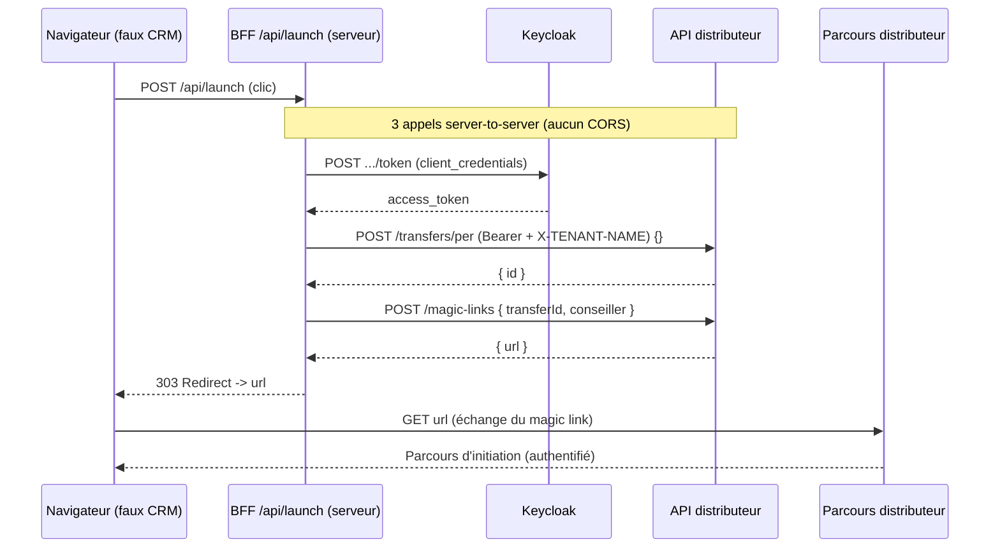

# permute-distrib-embedded-integration

Application de **référence** pour intégrer le parcours de transfert PMD de PERmute
dans un système tiers (un CRM, un espace conseiller…) via le système de
**magic link**.

Elle simule un **CRM client** (« Patrimoine Conseil ») : depuis un dossier de
souscription, un bouton _« Démarrer le transfert PMD »_ déclenche, **côté
serveur**, la chaîne complète d'appels au backend PERmute, puis redirige
l'utilisateur vers le parcours de transfert authentifié — **sans aucune
connexion**.

> Le but du repo est double : **documenter** les 3 appels à implémenter et
> fournir un exemple **exécutable** que vous pouvez lancer en local contre un
> environnement PERmute.

---

## Le flux en 3 appels

Au clic sur le bouton, un Route Handler serveur (`src/app/api/launch/route.ts`,
le **BFF**) rejoue le flux du compte de service externe **en une seule
requête** (le magic link expire en 60 s) :

1. **Token** — `POST {KEYCLOAK_BASE_URL}/realms/{tenant}/protocol/openid-connect/token`
   (grant `client_credentials` avec le compte de service) → `access_token` ;
2. **Création d'un brouillon vide** — `POST {DISTRIBUTEUR_API_BASE_URL}/transfers/per`
   (`Authorization: Bearer …` + en-tête `X-TENANT-NAME`) → `{ id }` ;
3. **Génération du magic link** — `POST {DISTRIBUTEUR_API_BASE_URL}/magic-links`
   (mêmes en-têtes, corps `{ transferId, …identité conseiller }`) → `{ url }` ;
4. **Redirection 303** du navigateur vers `url` → atterrissage **authentifié**
   sur la première étape du parcours de transfert.



Les contrats détaillés des 3 appels sont implémentés dans
[`src/features/crm/magicLinkClient.ts`](src/features/crm/magicLinkClient.ts) —
c'est le fichier à lire pour reproduire l'intégration dans votre propre système.

---

## Contrats d'interface

> Schémas tirés des DTO backend (`CreateDraftPerTransferDTO`, `CreateMagicLinkDTO`,
> `MagicLinkDTO`). Les deux appels distributeur exigent les en-têtes
> `Authorization: Bearer <access_token>` et `X-TENANT-NAME: {DEMO_TENANT_SLUG}`.

### 1. Token — `POST {KEYCLOAK_BASE_URL}/realms/{KEYCLOAK_REALM}/protocol/openid-connect/token`

Body `application/x-www-form-urlencoded` : `grant_type=client_credentials`, `client_id`, `client_secret`.

```jsonc
// 200 OK
{ "access_token": "eyJ…", "token_type": "Bearer", "expires_in": 300 }
```

### 2. Créer un brouillon vide — `POST {DISTRIBUTEUR_API_BASE_URL}/transfers/per`

Body `{}` — tous les champs du brouillon (`holderFirstName`, `holderLastName`, …) sont optionnels.

```jsonc
// 200 OK (PerTransferDTO) — seul `id` est utilisé ici
{ "id": "019aabcd-1234-7000-9999-abcdef012345", "...": "…" }
```

### 3. Créer le magic link — `POST {DISTRIBUTEUR_API_BASE_URL}/magic-links`

Identité du **conseiller** (côté CRM partenaire) qui ouvrira le lien :

| champ | type | requis | contrainte |
| --- | --- | :---: | --- |
| `transferId` | string | ✅ | UUID — l'`id` renvoyé par l'appel 2 |
| `firstName` | string | ✅ | ≤ 100 |
| `lastName` | string | ✅ | ≤ 100 |
| `email` | string | ✅ | email valide, ≤ 255 |
| `externalId` | string | — | ≤ 255 — id stable du conseiller côté CRM, préféré à l'`email` pour la résolution |

```jsonc
// 200 OK (MagicLinkDTO) — lien à usage unique, valable 1 minute
{ "url": "https://{tenant}.<preprod>/transfers/…", "expiresAt": "2026-06-09T10:01:00Z" }
```

---

## Pré-requis

- **Node.js ≥ 20** et **pnpm** (`npm i -g pnpm`) ;
- un accès à un environnement **PERmute** (les URLs `DISTRIBUTEUR_API_BASE_URL`
  et `KEYCLOAK_BASE_URL`) ;
- un **compte de service** (`SA_CLIENT_ID` / `SA_CLIENT_SECRET`) et un **tenant
  de démo** (`DEMO_TENANT_SLUG`).

> 📩 Ces endpoints et ces identifiants vous sont **fournis par PERmute**. Ils ne
> figurent pas dans ce repo : aucun secret n'y est committé.

## Lancer en local

```bash
# 1. Dépendances
pnpm install

# 2. Config : copier .env.example en .env et renseigner les valeurs fournies par PERmute
cp .env.example .env

# 3. Démarrer
pnpm dev
```

Ouvrir **http://localhost:5500**, puis cliquer sur _« Démarrer le transfert
PMD »_. Un nouvel onglet s'ouvre et vous atterrissez, authentifié, sur la
première étape du parcours de transfert.

## Tests

```bash
pnpm test:ci    # tests unitaires (construction des URLs, formatage des erreurs)
pnpm lint:ts    # vérification TypeScript
```

---

## Sécurité

- **Secret côté serveur uniquement** : `SA_CLIENT_SECRET` est une variable
  serveur (pas de préfixe `NEXT_PUBLIC_`). Le token est obtenu par le BFF et
  **n'atteint jamais le navigateur**.
- **Tout passe par le BFF** : les 3 appels backend sont émis côté serveur
  (server-to-server) — aucune requête cross-origin depuis le navigateur, donc
  **pas de configuration CORS** nécessaire.
- **Redirection validée** : l'URL du magic link renvoyée par le back est
  contrôlée avant redirection (`assertSafeMagicLinkUrl` : schéma http(s) + hôte
  préfixé par le tenant), pour fermer tout open-redirect.
- **Gating** : l'app est inerte (**404**) si `NEXT_PUBLIC_ENV === 'production'`
  — sur toutes les pages (`layout.tsx`) et sur le BFF (`/api/launch`).

## Structure

```
src/
  app/
    page.tsx              # le faux CRM (« Patrimoine Conseil »)
    layout.tsx            # layout + gating production
    api/launch/route.ts   # le BFF : rejoue les 3 appels puis 303
    error/ , not-found/   # pages d'erreur
  features/crm/
    magicLinkClient.ts    # ⭐ les 3 appels (token / draft / magic-link)
    urls.ts               # construction des URLs + garde anti open-redirect
    errorFormat.ts        # messages d'erreur bornés et lisibles
    demoAdvisor.ts        # identité conseiller figée pour la démo
  env.mjs                 # validation des variables d'environnement
```

## Hors périmètre

- **Le retour vers le CRM** en fin de parcours (le parcours se termine sur
  l'écran de complétion côté distributeur).
- **La production** : l'app est volontairement inerte en production.
